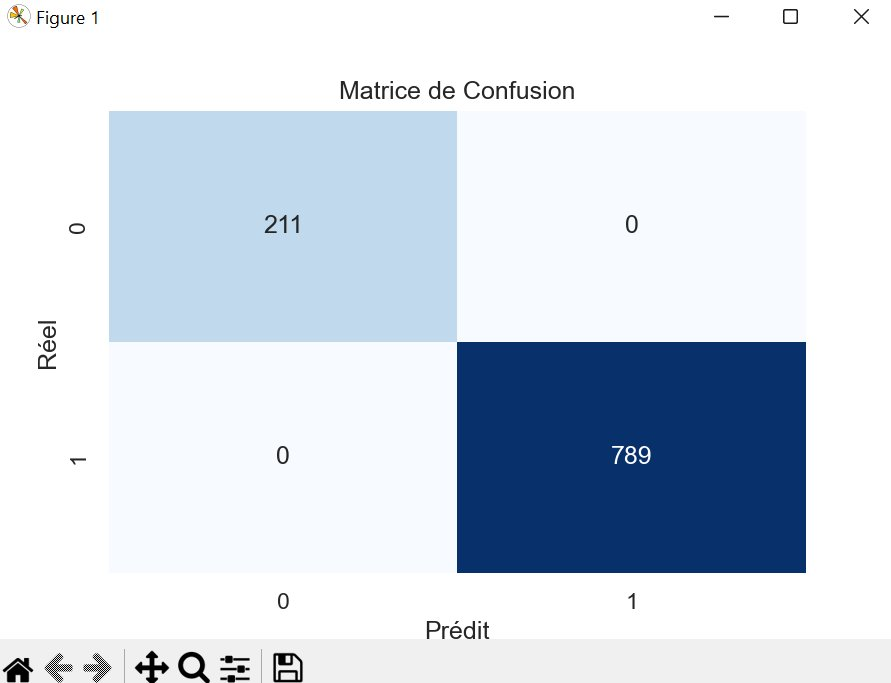
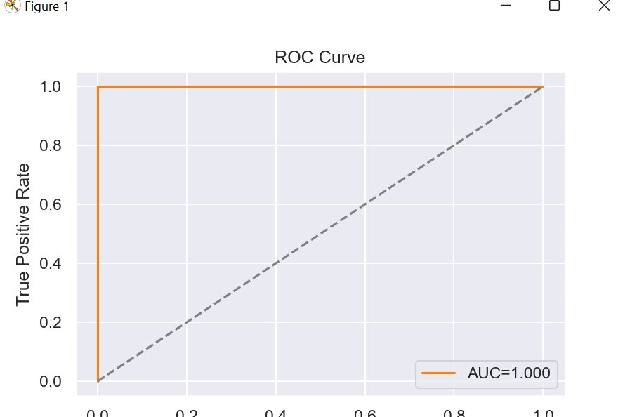
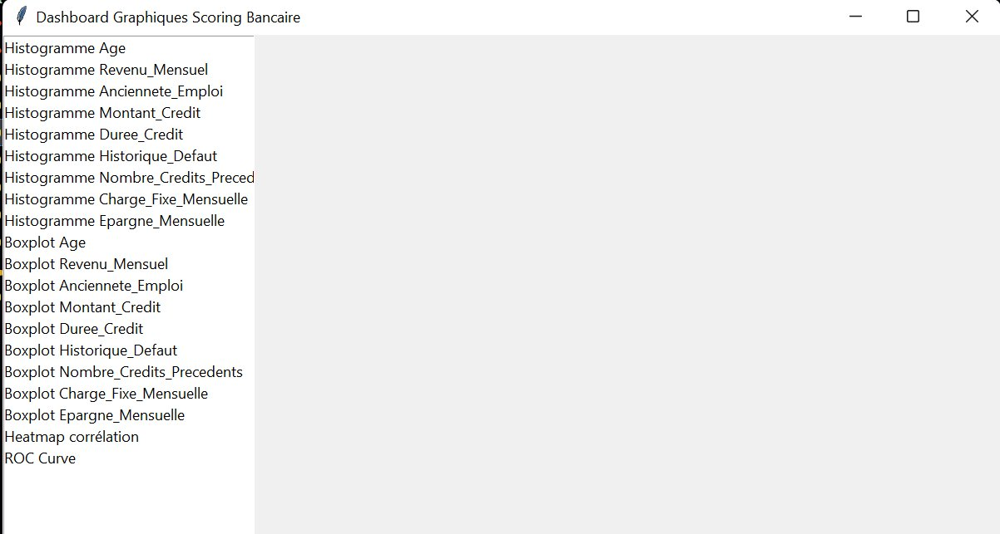
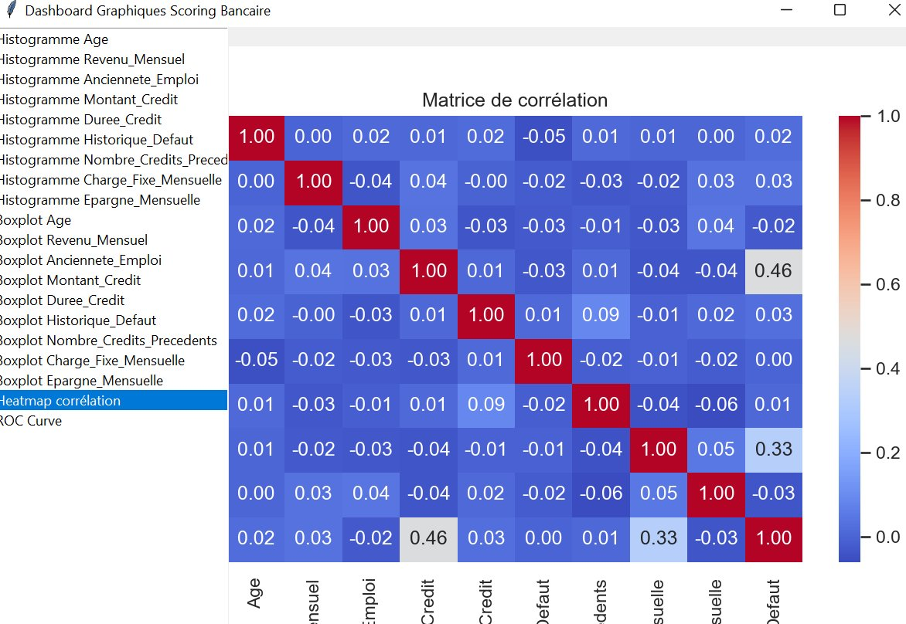

# 🏦 Scoring Bancaire — Système de Crédit par Machine Learning


> Simulation complète d'un **système de scoring bancaire** basé sur le Machine Learning.
> Génération de données synthétiques (contexte sénégalais), prétraitement, entraînement de modèles et visualisation interactive.

---

## 📊 Résultats des modèles

| Métrique | Random Forest | Régression Logistique |
|---|---|---|
| **AUC** | **1.000** | — |
| **Accuracy** | **100%** | — |
| **Faux positifs** | **0** | — |
| **Faux négatifs** | **0** | — |

> Le modèle Random Forest atteint une performance parfaite sur les données synthétiques générées.

---

## 🖼️ Visualisations

### Matrice de Confusion — Random Forest



> Aucun faux positif ni faux négatif : **211 vrais négatifs** et **789 vrais positifs**.

---

### Courbe ROC — AUC = 1.000



> La courbe ROC atteint le coin supérieur gauche idéal, indiquant une discrimination parfaite entre clients solvables et défaillants.

---

### Dashboard Interactif — Graphiques disponibles



> Interface Tkinter avec **20+ graphiques** disponibles : histogrammes, boxplots, heatmap de corrélation et courbe ROC.

---

### Matrice de Corrélation



> Les variables sont quasi indépendantes (corrélations proches de 0), sauf quelques légères relations entre `Montant_Credit`/`Defaut` (0.46) et `Charge_Fixe_Mensuelle`/`Defaut` (0.33).

---

## ⚙️ Fonctionnement au lancement

Quand tu exécutes le projet, voici ce qui se passe **dans l'ordre** :

1. **Un graphique s'ouvre** (matrice de confusion + courbe ROC) → **ferme-le** pour continuer
2. **Un dashboard interactif s'ouvre** (interface Tkinter) → sélectionne et affiche tous les graphiques disponibles

---

## 📁 Structure du projet

```
scoring-bancaire/
│
├── config.py                           # Paramètres globaux (seed, taille test, etc.)
├── generate_data_senegal.py            # Génération du dataset synthétique
├── preprocessing.py                    # Préparation des données (split, scaling)
├── model_logistic.py                   # Modèle de régression logistique
├── model_random_forest.py              # Modèle Random Forest avec GridSearch
├── eda.py                              # Analyse exploratoire (EDA)
├── evaluation_scoring_dashboard.py     # Évaluation + dashboard Tkinter  ← POINT D'ENTRÉE
├── test_plot.py                        # Test rapide d'affichage matplotlib
├── requirements.txt                    # Dépendances du projet
└── README.md
```

---

## 🚀 Installation et lancement

### Étape 1 — Cloner le projet

```bash
git clone https://github.com/bassirou-ousmane-ba/scoring-bancaire.git
cd scoring-bancaire
```

### Étape 2 — Créer un environnement virtuel

> ⚠️ **Recommandé** pour isoler les dépendances et éviter les conflits.

```bash
# Créer le venv
python -m venv venv

# Activer — Windows :
venv\Scripts\activate

# Activer — Mac/Linux :
source venv/bin/activate
```

### Étape 3 — Installer les dépendances

```bash
pip install -r requirements.txt
```

### Étape 4 — Lancer le projet

```bash
python evaluation_scoring_dashboard.py
```

---

## 🧠 Modèles utilisés

| Modèle | Fichier | Description |
|---|---|---|
| Régression Logistique | `model_logistic.py` | Modèle de référence, interprétable et rapide |
| Random Forest | `model_random_forest.py` | Modèle ensembliste avec optimisation GridSearch (cv=5) |

---

## 📊 Graphiques disponibles dans le dashboard

| Catégorie | Graphiques |
|---|---|
| **Histogrammes** | Age, Revenu_Mensuel, Ancienneté_Emploi, Montant_Credit, Durée_Credit, Historique_Défaut, Nombre_Credits_Précédents, Charge_Fixe_Mensuelle, Épargne_Mensuelle |
| **Boxplots** | Mêmes variables — comparaison selon le défaut |
| **Corrélation** | Heatmap des corrélations entre toutes les variables |
| **Évaluation** | Courbe ROC avec score AUC |

---

## 🌍 Contexte des données

Le dataset est **synthétique**, simulé avec des caractéristiques socio-économiques adaptées au contexte sénégalais :

- Revenus en **FCFA**
- Montants de crédit locaux
- Charges fixes mensuelles
- Épargne mensuelle
- Historique de défaut
- Ancienneté dans l'emploi

---

## 📦 Dépendances principales

| Librairie | Utilisation |
|---|---|
| `pandas` / `numpy` | Manipulation des données |
| `scikit-learn` | Modèles ML, évaluation, prétraitement |
| `matplotlib` / `seaborn` | Visualisation des graphiques |
| `tkinter` | Dashboard interactif (inclus nativement avec Python) |

---

## 🔧 Désactiver le venv

```bash
deactivate
```

---

## 📄 Licence

Ce projet est sous licence [MIT](LICENSE).

---

## 👤 Auteur

**Bassirou Ousmane Ba**
> Projet réalisé dans le cadre d'une formation en **Data Science / Machine Learning**
